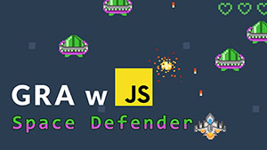

## Gra JS "Space defender"
Są to pliki do minikursu w stylu "projekt praktyczy" - gry napisanej w JavaScript.

Gra polega na zatrzymaniu wszystkich wrogich statków, które myślą tylko o jednym - podboju Ziemi!

Projekt składa się z 3 etapów:
- przygotowanie podstawy
- dopracowywanie gry
- sprzątanie kodu w celu pokazania dobrych praktyk

Pierwszy etap dostępny na [YouTube](https://youtu.be/M2HlBenSvW8).

Więcej na twórcastron.pl